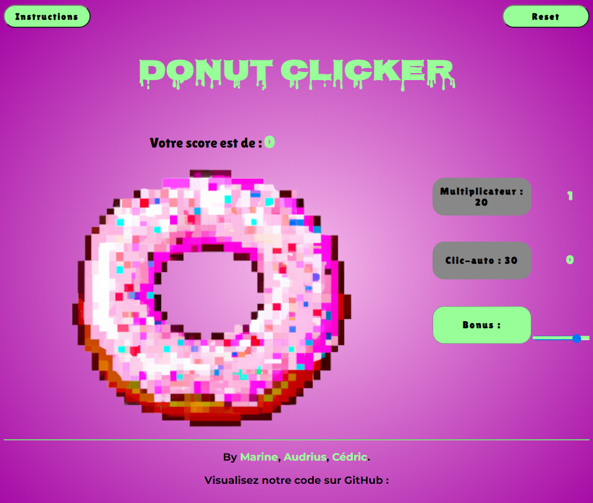
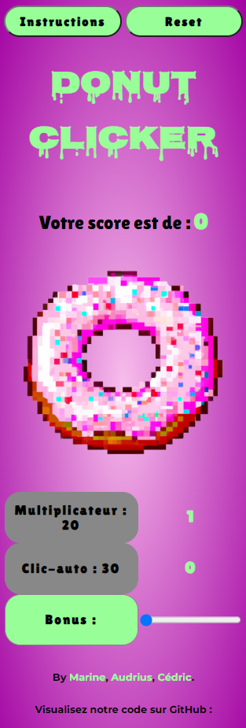

# ~~🍪 cookie-clicker 🍪~~ **NO** [🍩 Donut-clicker 🍩](https://marinevh.github.io/cookie-clicker/ "Donut-Clicker") 🤤

## _Version test :_

https://github.com/MarineVH/cookie-clicker-test

## _Version live :_

https://marinevh.github.io/cookie-clicker/

## _Contexte :_

Ce projet de **Coockie Clicker** est réalisé dans le cadre de la formation de **Web-Developper-Junior** chez [BeCode](https://becode.org/all-trainings/pedagogical-framework-junior-developer/ "BeCode"), selection **Swartz-8**.

## _Auteur :_

- ***[Marine](https://github.com/MarineVH "GitHub")*** 

## _Mais qu'est-ce qu'un **cookie-clicker**?_

Un cookie clicker, c'est un de ces jeux en ligne super simples qui te rendent accro. L'idée, c'est de cliquer comme un fou sur un cookie à l'écran pour gagner des cookies virtuels. Au fil du temps, ça devient de plus en plus dingue avec des trucs compliqués qui te permettent de produire des cookies automatiquement et de te fixer des objectifs toujours plus fous.

Ce genre de jeu, ça appartient à la catégorie des "idle games", c'est-à-dire des jeux où t'as juste à les laisser tourner en arrière-plan et ils continuent à te filer des trucs, même quand tu ne les regardes pas. C'est génial pour sa simplicité et c'est tellement addictif que tu risques de te retrouver à y passer un temps fou. Des fois, on a même entendu des joueurs dire que ça les avait un peu rendus accros.

## _Code :_

- 

- 

- 

## _Consignes :_

### Objectifs :

- Compétences JavaScript
- compétences d'équipe
- compétences en matière de conflit git

### Mission :

Créer un cookie clicker en équipe.

### Étape 1 : structure de base : ✅

Créer la structure de base du jeu en HTML, CSS et JavaScript avec un bouton de clic et un compteur initialisé à zéro.

### Étape 2 : préparer le JavaScript : ✅

Préparer des variables JavaScript pour contrôler le bouton, l'étiquette et le score.

### Étape 3 : augmenter le score : ✅

Augmenter le score de 1 chaque fois que le bouton est cliqué et afficher le score actuel.

### Étape 4 : faire un multiplicateur : ✅

Ajouter un bouton multiplicateur pour augmenter le nombre de points par clic.

### Étape 5 : prix du multiplicateur : ✅
 
Faire en sorte que l'achat du multiplicateur nécessite des points du joueur.

### Étape 6 : pas de crédit : ✅

Empêcher les scores négatifs et mettre à jour l'affichage après un achat.

### Étape 7 : afficher le compteur multiplicateur : ✅

Afficher le compteur de multiplicateur (par exemple, "multiplicateur x5").

### Étape 8 : augmenter le coût : ✅

Augmenter le coût à chaque achat de multiplicateur.

### Étape 9 : afficher le coût : ✅

Afficher le coût d'achat du multiplicateur.

### Étape 10 : clic automatique : ✅

Implémenter un bonus de clic automatique qui ajoute automatiquement un clic au score toutes les x secondes.

### Étape 11 : bonus : ✅

Ajouter un bonus qui double le score par clic pendant 30 secondes, avec une minuterie affichée.

### Étape 12 : désactiver les boutons : ✅

Désactiver les boutons d'achat si le joueur n'a pas suffisamment de points.

### Étape 13 : rendez-le joli : ✅

Personnaliser l'apparence du Cookie Clicker avec CSS ou JavaScript.

## _Thème :_

Nous avons decidé de faire un **Donut Clicker** 🍩🍩🍩

**Version Mobile :**

